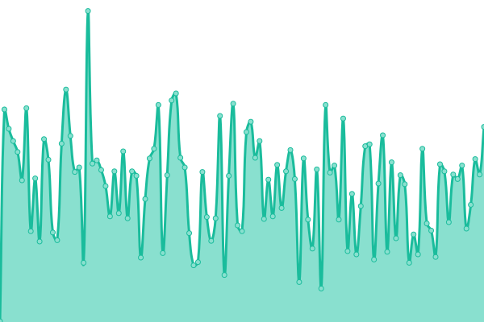
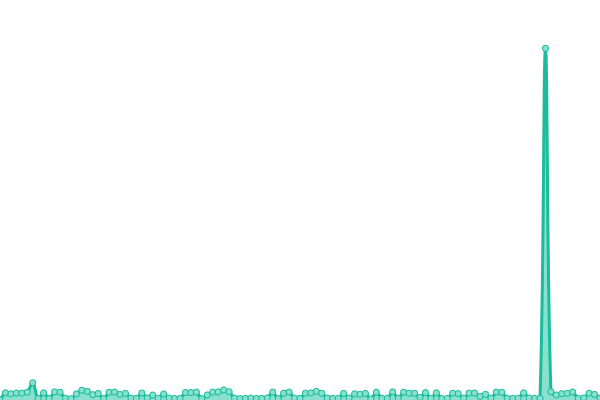

# [📈 Live Status](https://0xflotus.github.io/github-page-monitoring/): <!--live status--> **🟩 All systems operational**

This repository contains the open-source uptime monitor and status page for [0xflotus](0xflotus.github.io), powered by [Upptime](https://github.com/upptime/upptime).

With [Upptime](https://upptime.js.org), you can get your own unlimited and free uptime monitor and status page, powered entirely by a GitHub repository. We use [Issues](https://github.com/0xflotus/github-page-monitoring/issues) as incident reports, [Actions](https://github.com/0xflotus/github-page-monitoring/actions) as uptime monitors, and [Pages](https://0xflotus.github.io/github-page-monitoring) for the status page.

<!--start: status pages-->
<!-- This summary is generated by Upptime (https://github.com/upptime/upptime) -->
<!-- Do not edit this manually, your changes will be overwritten -->
<!-- prettier-ignore -->
| URL | Status | History | Response Time | Uptime |
| --- | ------ | ------- | ------------- | ------ |
|  [Personal Github Page](https://0xflotus.github.io) | 🟩 Up | [personal-github-page.yml](https://github.com/0xflotus/github-page-monitoring/commits/HEAD/history/personal-github-page.yml) | 

 228ms
     
 | 

<a href="https://0xflotus.github.io/github-page-monitoring/history/personal-github-page">100.00%</a>
    

|  [Is a dev Page](https://0xflotus.is-a.dev) | 🟩 Up | [is-a-dev-page.yml](https://github.com/0xflotus/github-page-monitoring/commits/HEAD/history/is-a-dev-page.yml) | 

 83ms
     
 | 

<a href="https://0xflotus.github.io/github-page-monitoring/history/is-a-dev-page">100.00%</a>
    

<!--end: status pages-->
